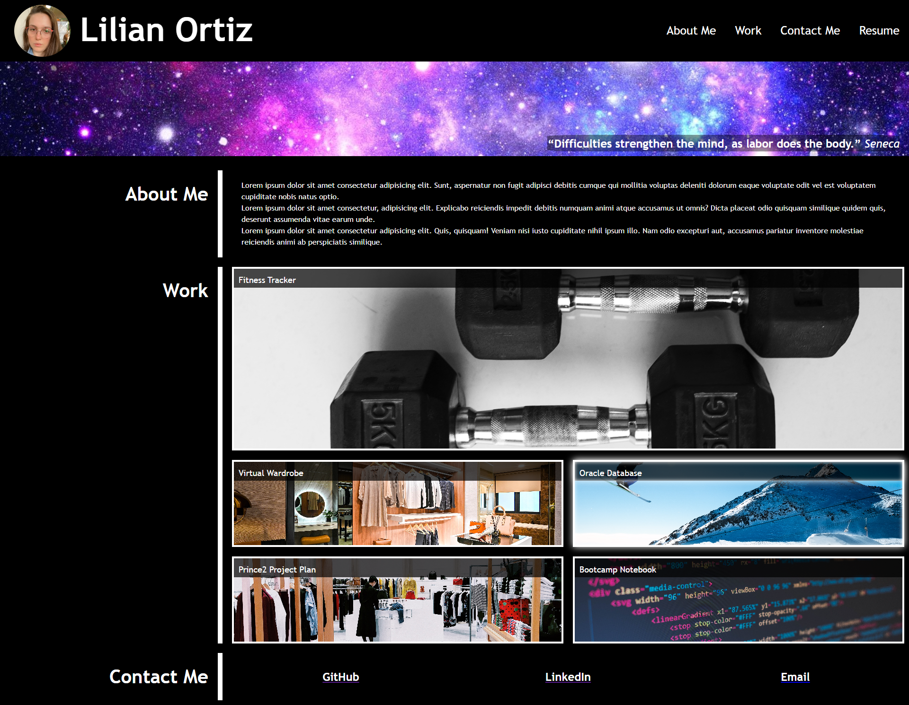
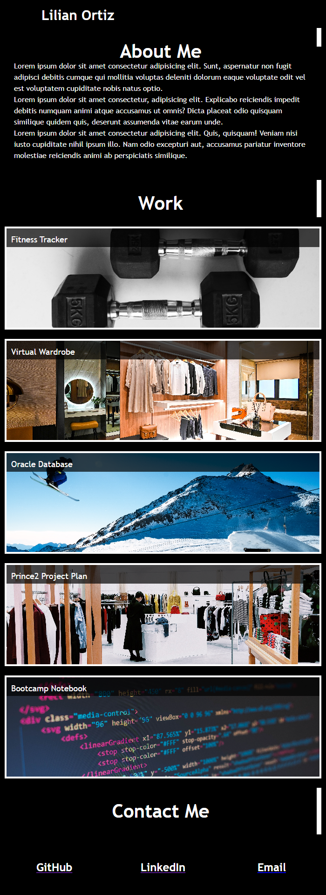

# Bootcamp Challenge `2`: Portfolio

This repo contains a single page website that acts as a personal portfolio.

This portfolio is meant to be a working in progress and will be continually improved in the course of the EDX Trilogy Frontend Bootcamp.

The website was deployed using GitHub Pages and can be viewed [here](https://ortizlilian.github.io/bootcamp-challenge-2/).

## Mockup

This is what the website looks like when the screen size is bigger than 992px.

And this is the website appearance when the scree size is smaller than 992px.

## Acceptance Criteria

* When the page is loaded the page presents your name, a recent photo or avatar, and links to sections about you, your work, and how to contact you
* When one of the links in the navigation is clicked then the UI scrolls to the corresponding section
* When viewing the section about your work then the section contains titled images of your applications
* When presented with the your first application then that application's image should be larger in size than the others
* When images of the applications are clicked then the user is taken to that deployed application
* When the page is resized or viewed on various screens and devices then the layout is responsive and adapts to my viewport
